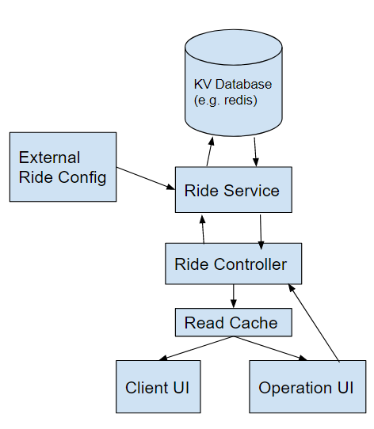

# Universal Studios Ride Tracker - Proposal and Proof of Concept
### By: nikolas.wangsaputra

## Architecture


The core of the system would be the ride service, which initiates the ride data from external configuration file / source and create object to store & return to the downstream. It defines functions to get ride info, add queue, start ride, and clear ride informations.

These functions are exposed with HTTP API endpoints to the clients by ride controller module, which will be used by customer app or ride operation tools. Customer app reads the ride information and display information needed for users as well as estimates the wait time for each ride. Ride operation app (not covered in PoC scope) may use the APIs to add people to queue, start the ride (clearing queue based on the ride capacity), and clear rides (such as on park closing).

A cache may be implemented (not covered in PoC scope) to reduce service calls for ride information since this data will be accessed frequently.


## Database
Based on the architecture design, we require a KV database to store the ride information, with the ride name as the key on POC
(for actual implementation will require proper ID for key)

```
  ["Bumper Car"]: {
    "name":"Bumper Car" // ride name
    "duration": 120, // duration of ride in second 
    "capacity": 24, // capacity of 
    "lastStart":1649255552, // epoch time of last ride start 
    "currentQueue": [] // current queue, array of integer with each integer representing group size
  }
```

On the PoC implementation this will be achieved using Redis.

## PoC Implementation
### How does your application server receive ride’s current capacity, information, etc?
Server will require a JSON object with the following structure:
```
{
  [<Name of the ride>] : {
    "duration": 120, // duration of ride in second 
    "capacity": 24, // capacity of ride
  }, 
  ...
}
```
Then upon initialization, server will also store the current queue of the ride as well as last
starting time of the ride to help calculate the estimated time. The full Ride object will be stored as described in database part.

### How do we know the amount of people in a queue for a ride?
We can query the respective key in the database to get the JSON object of the ride information, 
get the queue array, and sum up all the value in the array.  

### How do we calculate the estimated wait-time for a ride? And how does that propagate to all customers?
We calculate based on the remaining queue (greedily fit in the earliest customer groups to capacity), 
get how many remaining laps that need to be done to clear the queue, as well as the last ride starting time to add as a remainder.

To propagate to the customer, we are sending the queue info and last starting time, and let the app's FE calculate the estimate the same way.

### What is the information needed on customers' mobile devices to have a functioning application
No information required for basic functionality (other than internet access and current date/time).

## API Interfaces

### `GET /rideMap`
Returns current rides and their information.
```
Response
{
  "Roller Coaster": {
    "name":"Roller Coaster",
    "duration":240,
    "capacity":24,
    "lastStart":1649261069,
    "currentQueue":[2,4,2,8]
  },
  "Bumper Car":{
    "name":"Bumper Car",
    "duration":360,
    "capacity":12,
    "lastStart":0,
    "currentQueue":[]
  },
}
```

### `POST /addQueue`
```
Request
{
  "rideName": "Roller Coaster",
  "size": 8
}
```
Add group of certain size into a ride's queue

### `POST /startRide`
```
{
  "rideName": "Roller Coaster",
}
```
Starts a ride (update the lastStart to now, clear queue based on capacity).

### `POST /flushRides`
```
{}
```
Utility API to reset ride statuses.

## User Interface

A simple user interface is implemented using React Typescript for PoC purpose. 
It consists of cards of Ride information including name, duration of ride, and current estimated waiting time using calculation as described above.

## Future Recommendations
### At peak time, the data traffic can grow as much as 100 times of regular times.
Due to using key-value DB and O(1) access to each ride information, this design should fare quite well on high read traffic. Using a short living cache for Read operations will help to reduce the read load as well. 
Also, write traffic would be considerably low (since it will be capped on number of people in a park which physically won't be very high) and should not be a bottleneck during high time.

### Detecting if a ride is malfunctioning or is no longer running.

A suggested improvement would be to introduce status variable to store in the ride information, preventing actions on the ride and allows it to be shown in the app.